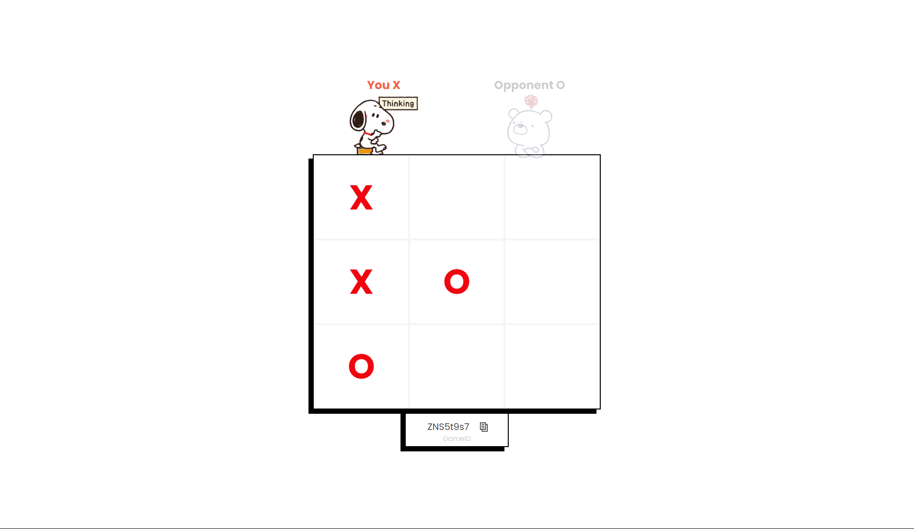

# TicTacToe
This is the front-end implementation of the classic two player game TicTacToe ( X-O ) with a major focus on real-time two player functionality. It also offers the usual ability to play against an AI agent over a real-time connection. Check out the backend server [here](https://github.com/edgarmuyomba/tictactoeGameServer).

## Features
- Create a new game
- Join an existing game session
- Play against AI agent

## Preview

## Built With
- React
- Typescript
- [SCSS](https://sass-lang.com/guide/)
- [Framer Motion](https://www.framer.com/motion/)